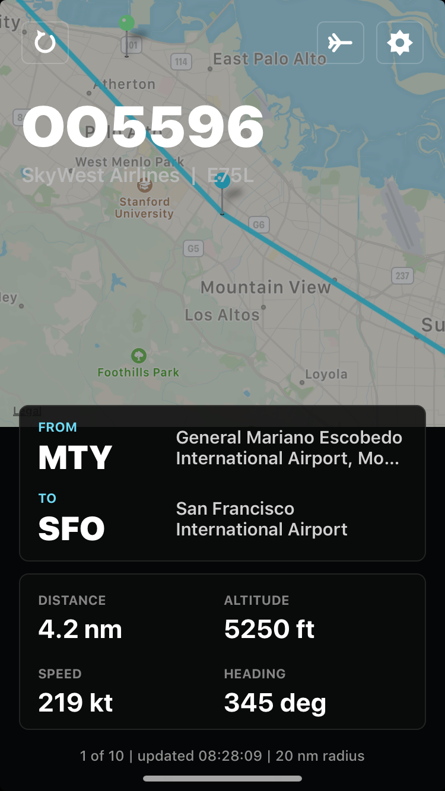
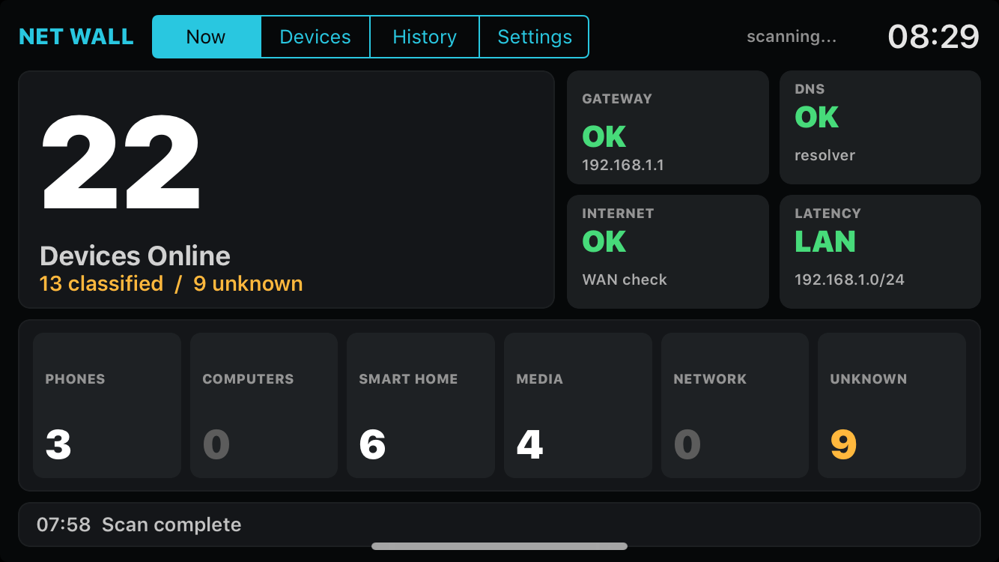
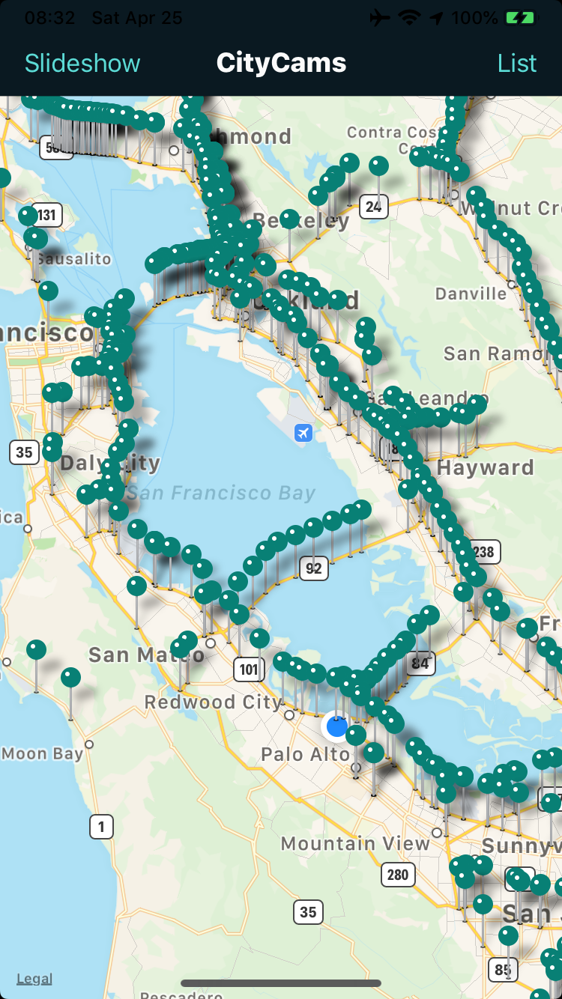
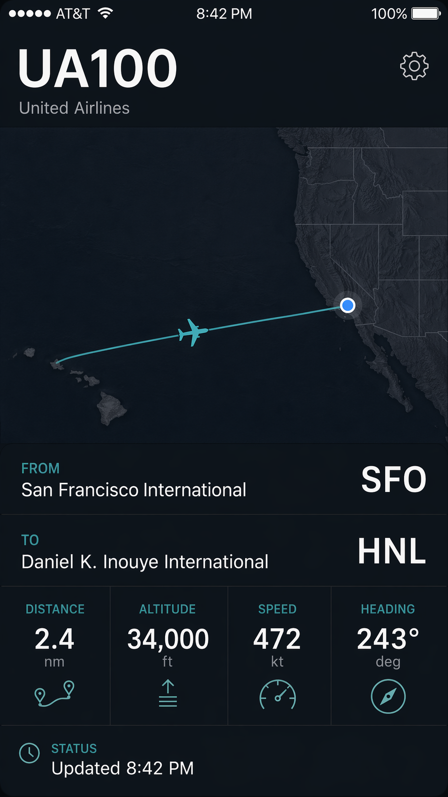
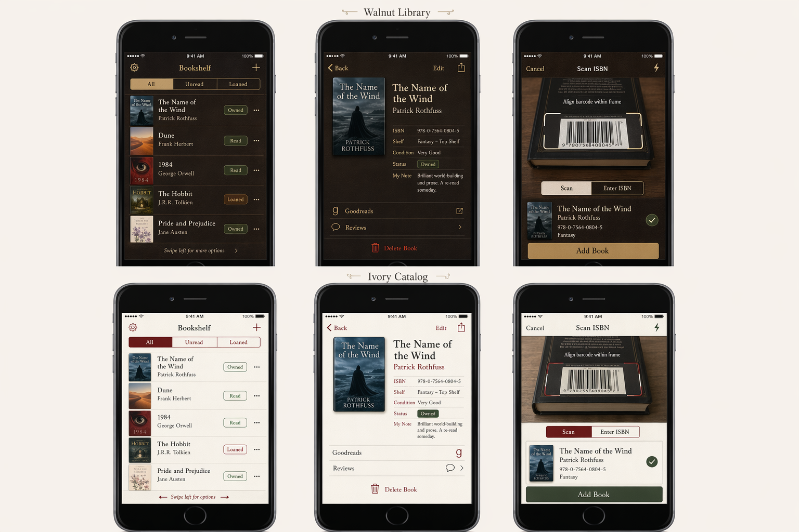
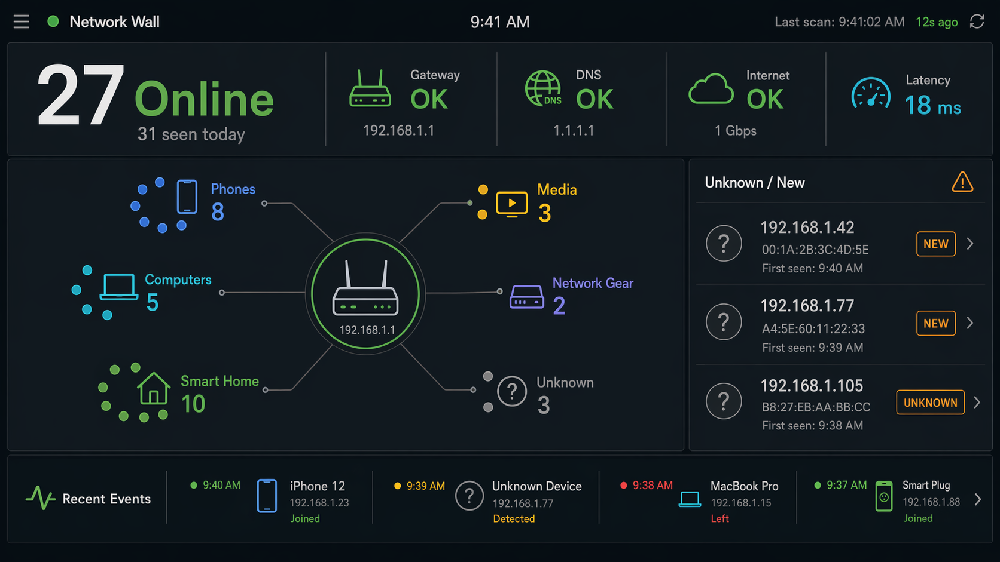

# ShelfApps: iPhone App Workspace

This workspace contains small UIKit apps designed around the iPhone 6 form factor and iOS 12 compatibility, while still fitting the normal Xcode developer lifecycle for physical iPhones.

ShelfApps started as a practical use for a stack of used iPhone 6s bought from eBay. The original idea was to use them as dedicated wall switches around the house. That turned into a broader set of small apps for old phones that can sit in fixed places and do one job well.

The phones are old as primary devices, but they still have useful screens, Wi-Fi, cameras, touch input, batteries, speakers, and enough CPU for small native apps. This repo keeps the apps intentionally simple: one app folder per device idea, app-local XcodeGen projects, iOS 12-compatible UIKit, and screenshots/docs beside each app.

## Build Story

The first working set of apps was built with Codex, GPT-5.5, and ImageGen 2 in a few focused sessions. The process was:

1. Pick a place in the house for the phone.
2. Decide the one job that phone should do.
3. Use ImageGen 2 to create a mockup or icon direction when the visual target was unclear.
4. Ask Codex to implement the app inside this repo structure.
5. Build and run it on the physical iPhone 6.
6. Iterate on whatever felt wrong on the actual device.

The iPhone 6 constraint is useful. The screen is small, the OS target is old, and the app needs to be readable at a glance. That keeps the first version of each app focused.

Codex handled the normal repo and app work: Objective-C UIKit, XcodeGen config, iOS 12 launch images, app icons, build scripts, `.env` handling, `.gitignore` cleanup, screenshots, README updates, attribution, and license cleanup. ImageGen 2 was useful mostly as a quick way to create a visual target for layout, density, color, and hierarchy.

## Build Stats

Stats from the app-specific Codex build threads. User messages counts human prompts in the build thread and excludes injected environment/AGENTS context. Agent wall time is the sum of Codex `task_complete` durations from local session logs, so it includes thinking, implementation, command execution, builds, deploys, and verification, but excludes idle gaps waiting for the next human reply. Token counts are Codex-reported cumulative tokens for each build thread; input includes cached context. LOC is app-local source line count for `.m`, `.h`, `.swift`, `.py`, `.c`, and `.mm` files, excluding generated Xcode projects, build products, payloads, assets, screenshots, plists, manifests, and `project.yml`.

| App | Codex threads | User messages | Agent wall time | Input tokens | Output tokens | App LOC |
| --- | ---: | ---: | ---: | ---: | ---: | ---: |
| OverheadFlight | 1 | 23 | 1h 19m | 39,529,534 | 143,906 | 2,035 |
| NetworkWall | 1 | 14 | 45m 51s | 18,246,063 | 89,542 | 2,809 |
| DriveDash | 1 | 12 | 34m 13s | 18,203,137 | 67,719 | 1,057 |
| Bookshelf | 1 | 12 | 43m 14s | 22,180,912 | 88,224 | 2,471 |
| CityCams | 1 | 12 | 1h 1m | 33,325,831 | 119,460 | 3,439 |
| ParkCams | 1 | 21 | 1h 17m | 44,514,004 | 160,784 | 3,866 |

Totals: 6 app-specific threads, 94 human prompts, 5h 40m of Codex wall time, 175,999,481 input tokens, 669,635 output tokens, and 15,677 app-local source lines.

## Device Ideas

The apps are organized around where the phone lives:

- A mantle phone can run ParkCams / RangerLens as a National Parks display.
- A phone near the back door can run OverheadFlight as a backyard plane spotter.
- A phone on a bookshelf can run Bookshelf as a personal library helper.
- A phone near the router can run NetworkWall as a local network status display.
- A desk or wall phone can run CityCams as a public camera viewer.
- A car phone can run DriveDash as a simple driving dashboard.

Some private local experiments and device-specific workflows are intentionally ignored. For example, private camera setups, local device identifiers, generated builds, IPAs, payloads, crash logs, and other personal workflow files should not be part of the public release.

## Released Apps

Only these app folders are intended for the public release:

| App | Preview | Description |
| --- | --- | --- |
| [OverheadFlight](apps/OverheadFlight) |  | Backyard plane spotter with nearby aircraft, route metadata, map context, and glanceable status. |
| [NetworkWall](apps/NetworkWall) |  | Router-side network status wall with device counts, gateway/DNS/internet checks, latency, unknown devices, and lightweight companion-script support. |
| [DriveDash](apps/DriveDash) |  | Lightweight car display using GPS, compass, battery, and motion sensors. |
| [Bookshelf](apps/Bookshelf) |  | Personal library helper with book details, ISBN scanning, visible covers, and loan tracking. |
| [CityCams](apps/CityCams) |  | Public city camera viewer for a fixed desk or wall display. |
| [ParkCams](apps/ParkCams) |  | National park image/feed browser with a display-oriented RangerLens experience. |

Other app folders are local experiments and are ignored for release, except for developer tooling that is explicitly documented.

## Developer Tooling

[CodexMobile](apps/CodexMobile) is an experimental Objective-C/UIKit app for an owned jailbroken/rooted iPhone 6-class device. It lets Codex run local app-builder workflows on the phone and install generated UIKit apps through the local AppBuilder toolchain.

CodexMobile is published as source and scripts only. Generated Xcode projects, build products, IPAs, payloads, device logs, crash reports, jailbreak entitlements, and bundled device binaries are intentionally ignored. A local developer must provide their own cross-compiled Codex binary, helper binaries, SDK/toolchain files, credentials, and signing/install setup.

The rooted-device workflow is intended for devices you own and control. It is not intended to bypass iCloud, Activation Lock, DRM, App Store policy on third-party devices, or any other access control on devices that are not yours.

## Mockups And Visual Direction

Some app directions started from ImageGen 2 mockups or generated icon concepts. These are not exact implementation screenshots; they were used as quick visual references before Codex translated the ideas into UIKit.

| App | Process image | How it helped |
| --- | --- | --- |
| OverheadFlight |  | Set the first-screen direction: dark map, large flight identifier, route context, altitude, speed, heading, and update status. |
| Bookshelf |  | Helped make the app feel like a small library catalog rather than a generic inventory screen. |
| NetworkWall |  | Gave a reference for a glanceable network panel with clear sections and operational status. |
| DriveDash |  | Provided icon direction for the car display app. |

## Layout

- `apps/<AppName>/`: app-specific source, `project.yml`, README files, assets, generated Xcode projects, build folders, and packaged output.
- `scripts/`: shared build, install, diagnostics, and companion data scripts.
- `media/codex-process/`: selected generated mockups and process images used for repo storytelling.
- `skills/`: reusable Codex instructions and references for future app work.

Each app owns its own XcodeGen configuration at `apps/<AppName>/project.yml`. There is intentionally no root `project.yml`.

## Environment

Private values belong in `.env`, which is ignored. Start from the template:

```sh
cp .env.example .env
```

Set `IPHONE_UDID` in `.env` if you use the USB installer and have more than one device connected. Do not commit `.env`.

## Build With Xcode

Generate a project for the app you want to work on:

```sh
cd apps/OverheadFlight
xcodegen generate
open OverheadFlight.xcodeproj
```

In Xcode, select your development team, adjust the bundle identifier if needed, pick a connected iPhone, and use the normal Run flow. The apps target iOS 12.0 for broad compatibility.

## Optional USB Install

For local unsigned iOS 12 device workflows, the shared installer remains available:

```sh
scripts/install_usb_unsigned_ios12.sh apps/OverheadFlight
scripts/install_usb_unsigned_ios12.sh apps/DriveDash
```

The installer reads app metadata from the selected app's `project.yml`, generates the Xcode project, builds with signing disabled, patches the Mach-O build version for iOS 12 compatibility, signs with `ldid`, packages an IPA, installs with `ideviceinstaller`, and verifies the bundle id.

## Jailbroken Device Workflows

Some local scripts support owned jailbroken/rooted iPhone 6 automation over USB, including screenshots, taps, ZXTouch control, and CodexMobile's AppBuilder install path. These scripts expect private values to live in `.env`, commonly `IPHONE_UDID`, `IPHONE_JB_SSH_USER`, `IPHONE_JB_SSH_PORT`, `IPHONE_JB_LOCAL_SSH_PORT`, and `IPHONE_JB_SSH_KEY`.

Do not commit real device identifiers, SSH keys, jailbreak passwords, Codex auth caches, API keys, app-server bearer tokens, generated device logs, or generated app bundles. `.env.example` documents the variable names without values.

Before staging a public commit, run:

```sh
scripts/check_open_source_hygiene.sh
```

The check scans stageable files for generated app artifacts, CodexMobile local binaries, diagnostics, local env files, and high-confidence secret patterns.

## Development Guidance

Build for the physical iPhone 6 screen first, not a desktop-sized idea of the app. Keep each first version small, native, and diagnosable:

- Use Objective-C UIKit and iOS 12 APIs unless there is a strong reason not to.
- Prefer programmatic views and explicit layout constraints.
- Include a `Default-667h@2x.png` launch image with matching `UILaunchImageFile`/`UILaunchImages` entries. Missing launch assets make iOS 12 letterbox the app on the iPhone 6.
- Keep each screen focused; add tabs or scrollable detail views instead of dense dashboard panels.
- Put long lists inside `UIScrollView` or table-style views with stable row heights.
- Use wrapper `UIView`s for panel backgrounds, borders, and rounded corners rather than relying on `UIStackView` drawing behavior.
- Keep generated icons, launch images, and source artwork inside the app folder.
- Show runtime status and errors in the app because physical-device debugging on older iOS versions can be less reliable with modern Xcode.
- For data-heavy apps, keep the phone UI simple and push richer collection into optional root-level scripts or local JSON endpoints.

## App Icons

Apps that avoid asset catalogs should include the PNG icon sizes referenced by `Info.plist`:

- `AppIcon20x20@2x.png`, `AppIcon20x20@3x.png`
- `AppIcon29x29@2x.png`, `AppIcon29x29@3x.png`
- `AppIcon40x40@2x.png`, `AppIcon40x40@3x.png`
- `AppIcon60x60@2x.png`, `AppIcon60x60@3x.png`

Keep the full-size source image under the app folder, for example `apps/<AppName>/IconSource/`. Do not bake rounded corners into icon PNGs.

## Launch Screen

Every app should include an app-local launch asset so iOS 12 treats it as native to the 4.7-inch iPhone 6 display. The preferred setup in this workspace is:

- `apps/<AppName>/<AppName>/Default-667h@2x.png`, sized `750x1334`
- `Info.plist` key `UILaunchImageFile` with value `Default`
- `Info.plist` `UILaunchImages` entry for `{375, 667}` portrait using `Default-667h`

Launch storyboards are acceptable when `ibtool` compiles them in the current Xcode setup, but static launch images are the safer default for these iOS 12 builds.

## License And Attributions

This repository's original source code is released under the MIT License. See `LICENSE`.

External APIs, camera feeds, flags, book metadata, aircraft data, park data, photos, and trademarks remain subject to their own terms. See `ATTRIBUTIONS.md` before distributing public builds or operating hosted services based on these apps.
