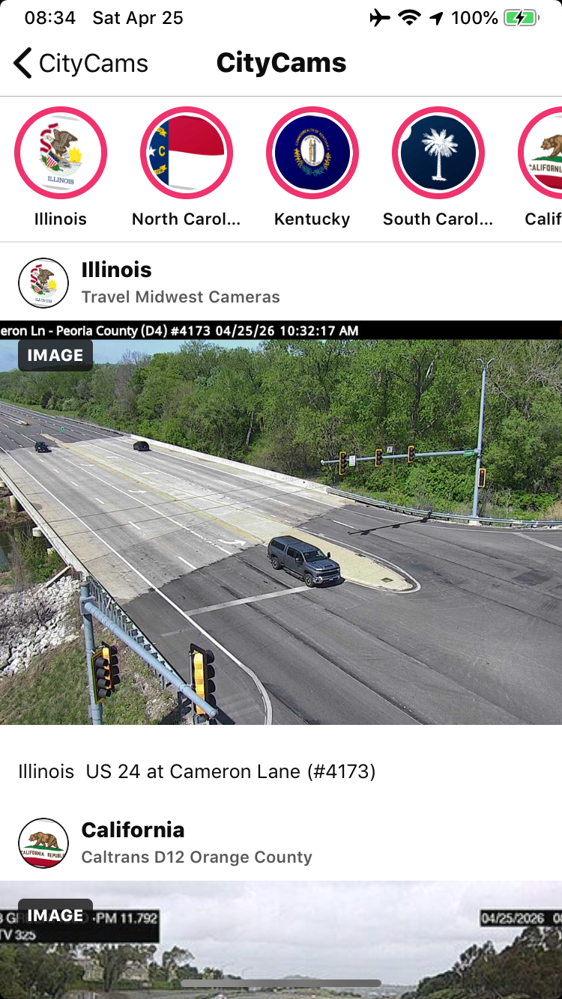

# CityCams

CityCams is an Objective-C UIKit app designed around the iPhone 6 form factor. It pulls public camera feeds from government traveler-information sources, normalizes each feed into a shared camera model, and browses them by state, city, and source.

## Screenshots

<p>
  
  
</p>

The root screen can toggle between the state list and a camera map. The map asks for when-in-use location access so it can center near the user, then falls back to fitting available camera pins if location is unavailable.

The root screen also has a live slideshow mode. It randomly rotates through playable HLS feeds full-screen, keeps a subtle location label over the video, and preloads/prerolls the next stream before crossfading so broken or slow feeds are skipped instead of shown.

An experimental social feed UI is available from the root screen. It keeps the original browser intact, but presents cameras as randomized posts grouped into state/source accounts with circular story entries. State/source avatars use bundled state flag thumbnails from `CityCams/StateFlags`, generated by `tools/fetch_state_flags.py`.

The built-in providers include:

- Virginia 511 / VDOT: live HLS feeds plus thumbnails from the public camera map layer.
- California Caltrans CWWP2: district CCTV JSON with HLS where available and recent JPEG images as fallback.
- Delaware DelDOT, FL511, Iowa DOT, Illinois Travel Midwest, Kentucky traffic cameras, Michigan Mi Drive, MoDOT, Montana 511, DriveNC, North Dakota Travel Information, New Mexico Roads, OHGO, Oregon TripCheck, South Carolina 511, and South Dakota 511 where public JSON or GeoJSON feeds are available.

All 50 states appear in the top-level browser. States without a wired public feed adapter are shown with an empty status so new sources can be added without changing navigation.

## Refresh Policy

The catalog loads cached feeds immediately and refreshes only when the cached catalog is at least 24 hours old. Refreshes run quietly through the catalog layer on launch or iOS background fetch; there is no foreground refresh button.

## Extending Sources

New feeds should be added as small provider classes in `CCCameraCatalog.m`. Providers only need to implement:

```objc
- (void)fetchCamerasWithCompletion:(CCCameraProviderCompletion)completion;
```

Each provider should return normalized `CCCamera` records with:

- `stateCode`
- `city`
- `sourceName`
- `title`
- `imageURL`
- `streamURL` when a direct HLS `.m3u8` feed exists
- `sourceURL`
- `feedType`

Keep provider-specific parsing private to the provider. The rest of the app groups and renders `CCCamera` objects without knowing the source schema. Prefer adding a `CCConfiguredProvider` entry when the source fits an existing parser shape; add a dedicated parser only when the source schema is materially different.

## Build and Install

From the workspace root:

```sh
scripts/install_usb_unsigned_ios12.sh apps/CityCams
```
