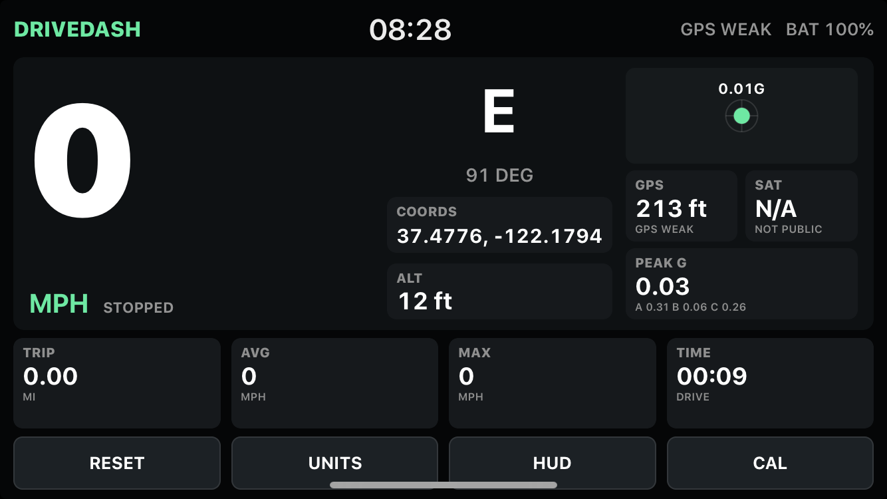

# DriveDash

Offline UIKit dashboard for iPhone 6-class devices on iOS 12 and later.

## Screenshot

<p>
  
</p>

## Features

- GPS speed with mph/km/h toggle
- Stationary speed deadband and weak-fix filtering to reduce false GPS speed jumps at stoplights or indoors
- Clock, battery, heading, GPS quality, coordinates, and altitude
- Temperature tile showing phone thermal condition; iPhone 6 does not expose an ambient air temperature sensor to public iOS apps
- Native iPhone 6 launch images to avoid letterboxed/compatibility-mode layout
- Trip distance, trip time, average speed, and max speed
- CoreMotion g-meter with acceleration and braking on the vertical axis, plus cornering peaks
- HUD mirror mode for windshield reflection
- Motion calibration for the phone mount
- Manual `LIGHT` button for the iPhone torch/flashlight
- Local trip summary storage in `NSUserDefaults`

## GPS Satellite Count

iOS 12 CoreLocation does not expose the raw GPS satellite count to apps. DriveDash shows a `SAT` tile, but it reports `N/A` rather than inventing a number. Use the `GPS` accuracy tile and `GPS STRONG` / `GPS OK` / `GPS WEAK` status as the reliable public signal quality indicator.

## Temperature

DriveDash cannot show true ambient or cabin temperature from the iPhone 6 alone. iOS does not provide a public ambient temperature sensor reading, and the app is designed to work offline with no external hardware. The `TEMP` tile therefore reports `N/A` for ambient temperature and uses iOS thermal state as the best built-in temperature-related signal: `PHONE OK`, `PHONE WARM`, `PHONE HOT`, or `COOL DOWN`.

## GPS Notes

If the status stays on `GPS STARTING`, check that Location Services are enabled and DriveDash has `While Using the App` permission in iOS Settings. The phone also needs a real sky view for an initial fix; inside a house, garage, or dense dashboard mount it may only report weak fixes. When accuracy is weak, DriveDash holds speed at zero for low-confidence movement instead of showing noisy stationary jumps.

Airplane Mode does not make the app require internet, but it removes cellular and Wi-Fi assistance that iOS may use for faster location acquisition. DriveDash now retries GPS acquisition while waiting and changes the status from `GPS STARTING` to `NO GPS FIX` and then `NEED SKY` when CoreLocation has not returned any usable fix.

## Build And Install

From the workspace root:

```sh
scripts/install_usb_unsigned_ios12.sh apps/DriveDash
```

The app is pure Objective-C. It does not link Swift runtime libraries.
