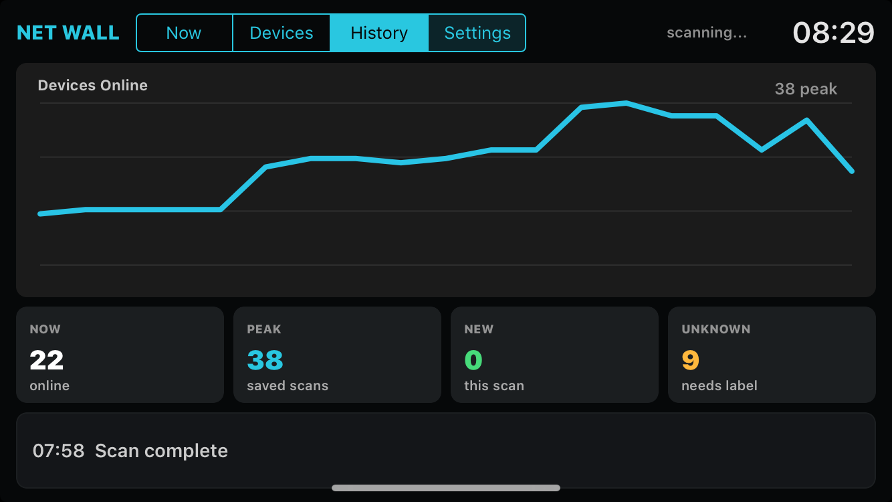
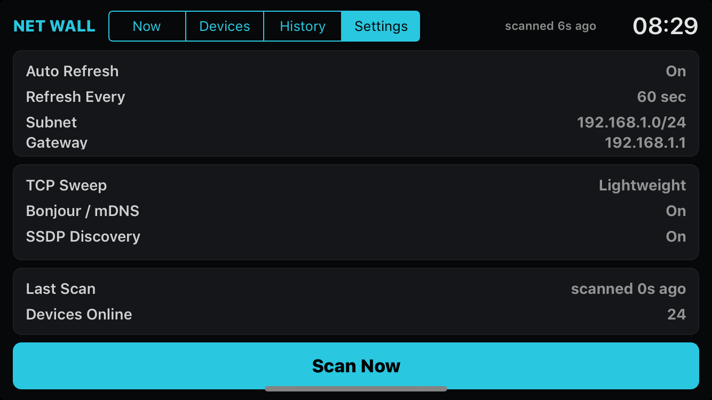

# NetworkWall

NetworkWall is a landscape-first local network dashboard for iPhone 6-class devices on iOS 12 and later.

The first version scans the active Wi-Fi subnet, shows the number of reachable devices, groups devices by inferred type, keeps a small local history, and exposes simple scan settings for a wall-mounted display.

## Screenshots

<p>
  
  
  
</p>

Build and install from the repository root:

```sh
scripts/install_usb_unsigned_ios12.sh apps/NetworkWall
```
