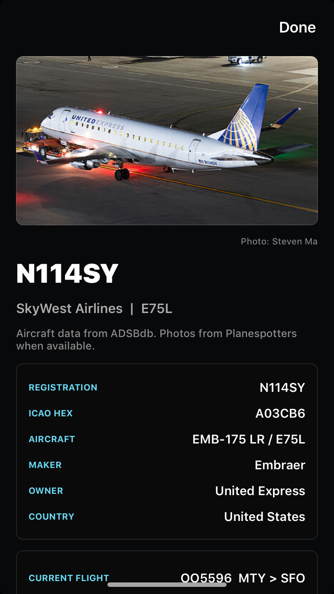
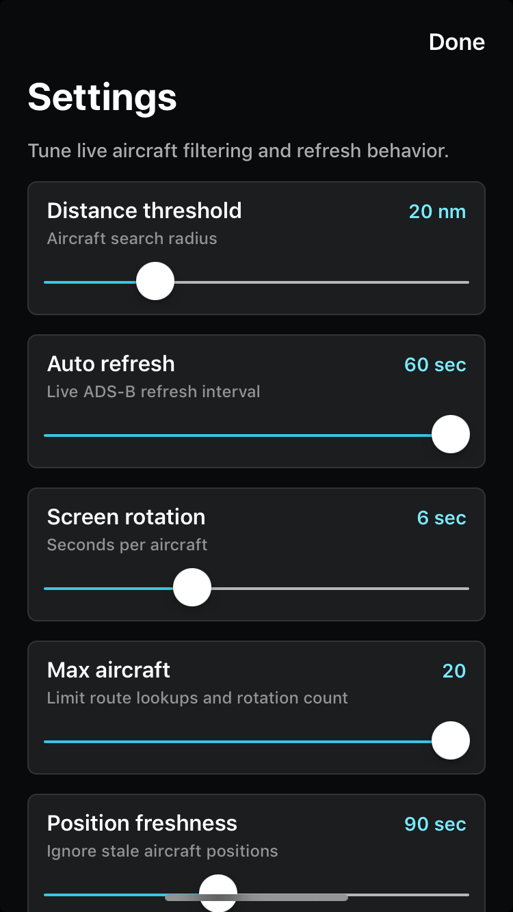

# OverheadFlight

Small UIKit app for an iPhone 6/iOS 12 device. It requests location, fetches live ADS-B aircraft near the phone, looks up route metadata when available, and rotates through matching flights every few seconds.

## Screenshots

<p>
  
  
  
</p>

## Data Sources

- Aircraft near the phone: `https://api.adsb.lol/v2/lat/{lat}/lon/{lon}/dist/{nm}`
- Callsign route metadata: `https://api.adsbdb.com/v0/callsign/{callsign}`

Route data is best-effort. If ADSBdb has a plausible route, the app shows passenger-facing route details; otherwise it falls back to the raw ADS-B callsign and available live aircraft telemetry.

## Local Build

From this folder:

```sh
xcodegen generate
xcodebuild -project OverheadFlight.xcodeproj -target OverheadFlight -sdk iphoneos -configuration Debug CODE_SIGNING_ALLOWED=NO build
```

From the workspace root, build and install over USB:

```sh
scripts/install_usb_unsigned_ios12.sh apps/OverheadFlight
```
