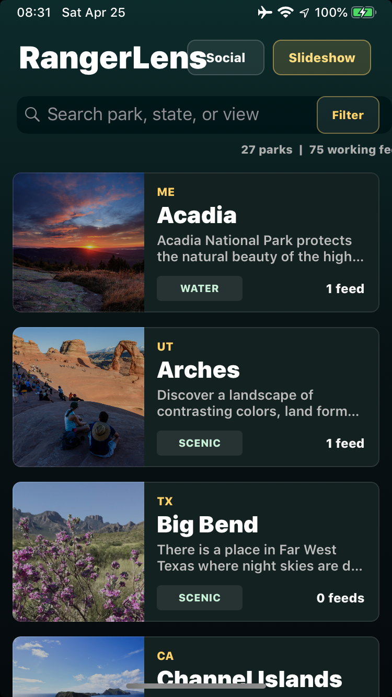
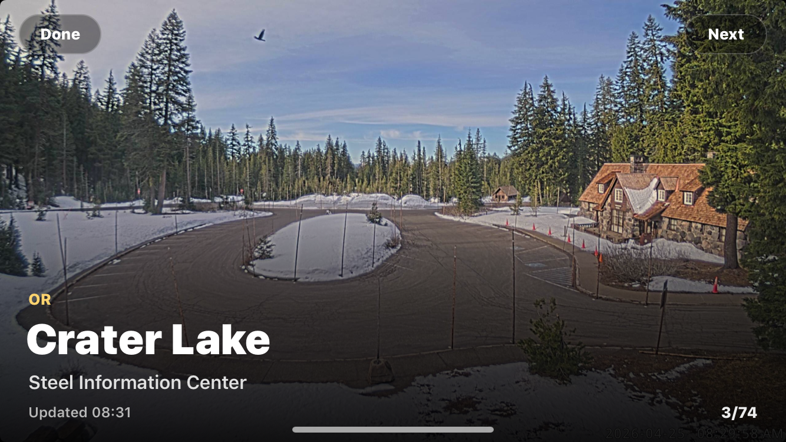
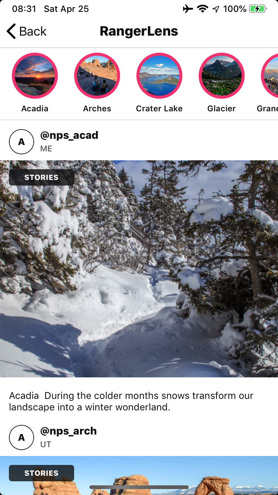

# RangerLens

RangerLens is an Objective-C UIKit app designed around the iPhone 6 form factor. It browses a bundled National Park Service webcam manifest, validates direct still-image and HLS stream feeds natively, and renders those feeds with UIKit and AVKit instead of WebKit.

## Screenshots

<p>
  
  
  
</p>

Screen recording: [RPReplay_Final1777131164.mp4](screenshots/RPReplay_Final1777131164.mp4)

## Source Catalog

The catalog is generated from the official NPS API and official NPS webcam pages. The API key stays in the workspace `.env`; it is only used by the local manifest builder and is not bundled into the app. The generated `ParkCams/ParkCamsManifest.json` contains public park metadata, official park image URLs, direct `jpg`/`m3u8` feed URLs, and validation notes for filtered feeds.

Refresh the manifest after updating `.env`:

```sh
cd apps/ParkCams
python3 Diagnostics/build_nps_manifest.py
```

Representative official sources:

- NPS overview: https://www.nps.gov/choh/learn/kidsyouth/nps-webcams.htm
- NPS webcam search: https://www.nps.gov/search/?affiliate=nps&query=webcams
- Yellowstone webcams: https://www.nps.gov/yell/learn/photosmultimedia/webcams.htm
- Glacier webcams: https://www.nps.gov/glac/learn/photosmultimedia/webcams.htm
- Mount Rainier webcams: https://www.nps.gov/mora/learn/photosmultimedia/webcams.htm
- Grand Canyon webcams: https://www.nps.gov/grca/learn/photosmultimedia/webcams.htm

## Build and Install

From the workspace root:

```sh
scripts/install_usb_unsigned_ios12.sh apps/ParkCams
```
